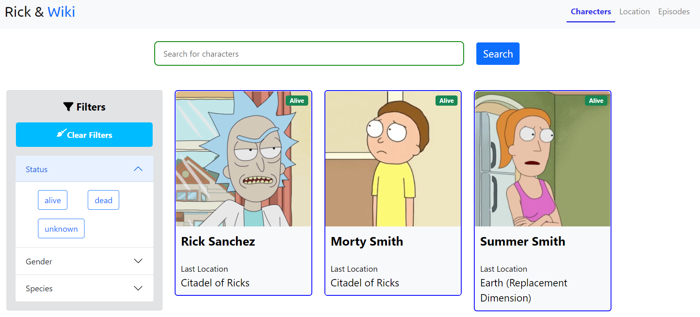

## See Live Demo

### Visit here for live demo: [Rick and Wiki](https://rick-and-wiki.vercel.app/)

\

## Run on You PC

note: You need to have [node](https://nodejs.org) installed on your pc

- Download this repository on your computer\
  `git clone https://github.com/sakibcy/rick-morty-wiki.git`
- then `npm start`

Open [http://localhost:3000](http://localhost:3000) to view it in your browser.

The page will reload when you make changes.\
You may also see any lint errors in the console.
